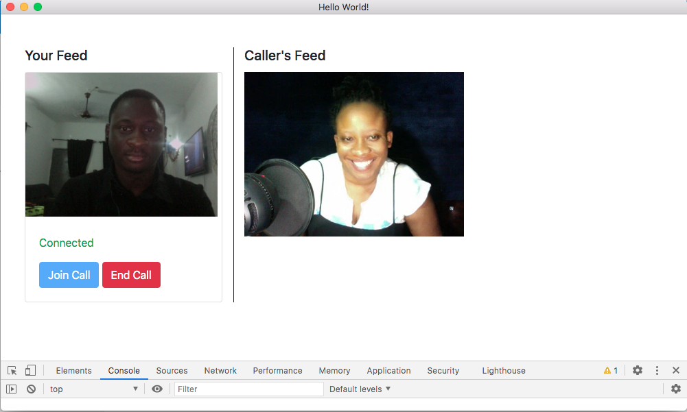

# Video Calling with Electron.js and Twilio Programmable Video

## Project Setup

### Prerequisites

- Node.js Installed
- [Yarn](https://yarnpkg.com/) installed

### Configuration

- Navigate to the root of the folder
- Install dependencies using `npm install`
- Create a `.env` file at the root and fill in the details shown below:

```
ACCOUNT_SID=XXX-XX-XXXXX
API_KEY_SID=XXX-XX-XXXXX
API_KEY_SECRET=XXX-XX-XXXXX
ROOM_NAME=testroom

```

- Run the application using `npm start`

## Screenshots

Call in session


